<!-- _class: titre -->

# **A Hardware-Agnostic GPU Acceleration for the n-Dimensional QuickHull Algorithm**

<strong>Alexis ENGLEBERT</strong>

Sous la direction du Pr. Benoît LEGAT

  Jury : Jean-François REMACLE, Nathan TIHON, Tom BARBETTE  
  24 juin 2026 - Université catholique de Louvain (UCLouvain)

---

# Table des matières

- Une enveloppe convexe ?
- QuickHull
- État de l'art
- Contribution
- Résultats
- Conclusion

--- 
<!-- _class: sep -->

# Une enveloppe convexe ?

---

# Une enveloppe convexe ?

Une enveloppe convexe d'un ensemble $\mathcal{S}$ est le plus petit ensemble convexe qui contient $\mathcal{S}$.

$\rightarrow$ dimension $n$ !

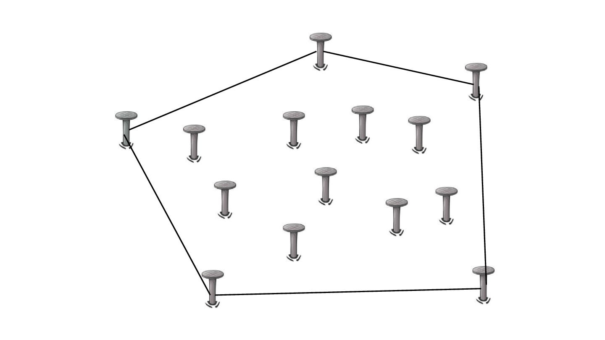

*Figure 1: Exemple d'enveloppe convexe en 2D*

--- 

# Pourquoi ?

* Jeu vidéo $\rightarrow$ collisions
* Machine learning $\rightarrow$ boundary
* Computer vision $\rightarrow$ Analyse de silhouettes
* $\cdots$

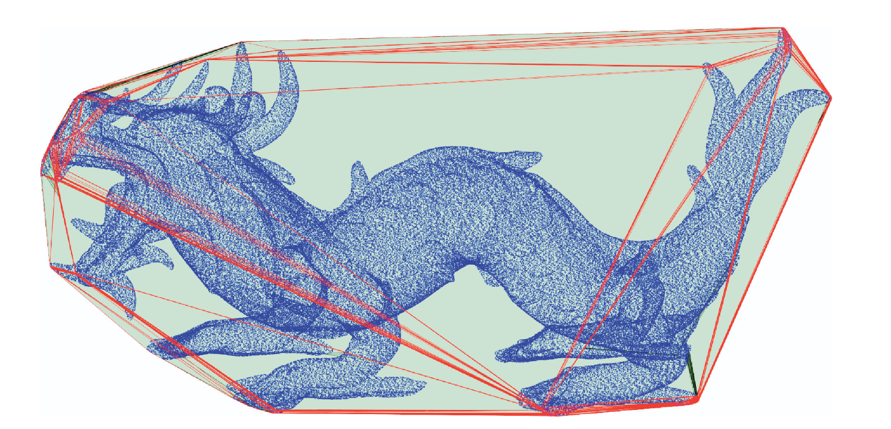

*Figure 2: Enveloppe convexe d'un modèle 3D contenant 3.6 millions de points [1]*

--- 
# Motivation

- Les données grandissent de plus en plus et les GPU offrent un parallélisme massif $\rightarrow$ rendre le calcul plus rapide !
- Mais il n'existe à ma connaissance aucune bibliothèque pour calculer l'enveloppe convexe sur GPU qui soit :
  - n-D
  - hardware-agnostique
  - open source

$\rightarrow$ **Objectif**: Créer une bibliothèque open source qui implémente n-D QuickHull sur GPU. 

---
# Les algorithmes existants 
- Gift wrapping
- Double description
- Reverse search
- $\cdots$
- **QuickHull**

---
<!-- _class: sep -->

# QuickHull

---

# QuickHull

Étape 1: Trouver un simplexe.
Étape 2: Ajouter le point le plus loin de l'enveloppe.
Étape 3: Répéter l'étape 2, jusqu'à ce qu'il n'y ait plus de point.

---
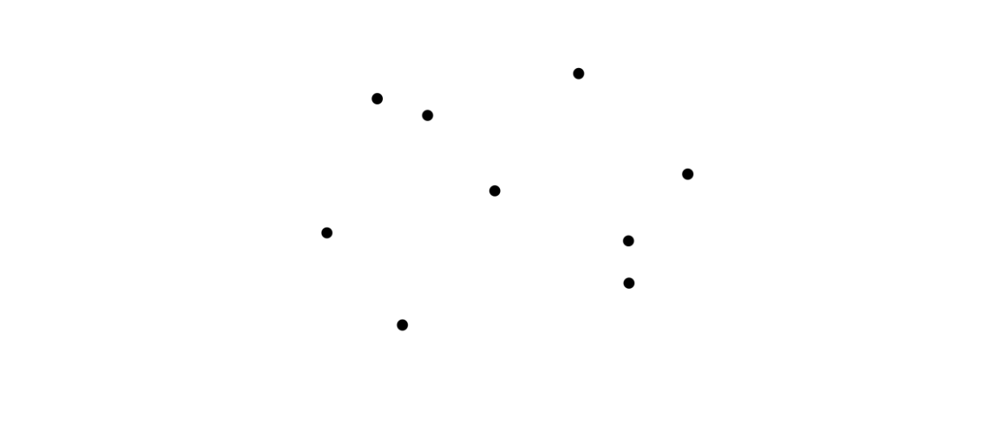

Source : D. Gregorius (Valve), Implementing QuickHull, GDC 2014

--- 
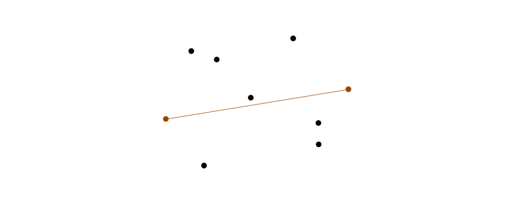

Source : D. Gregorius (Valve), Implementing QuickHull, GDC 2014

--- 
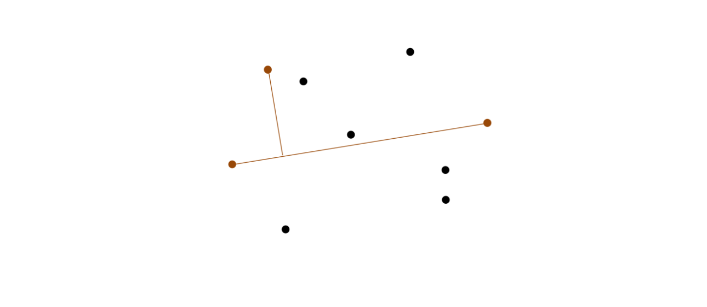

Source : D. Gregorius (Valve), Implementing QuickHull, GDC 2014

--- 
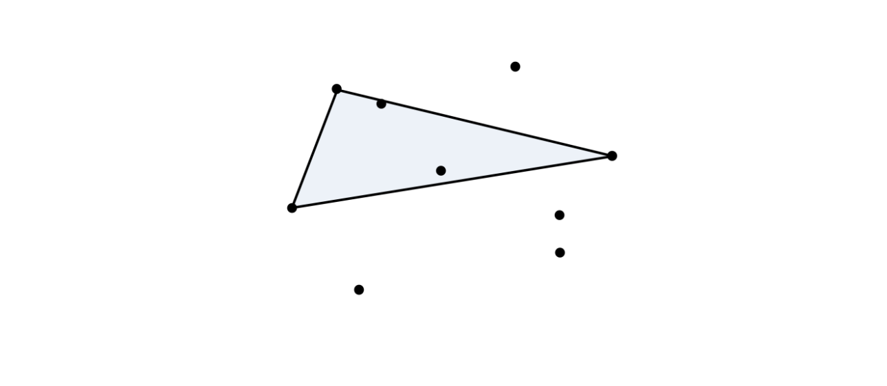

Source : D. Gregorius (Valve), Implementing QuickHull, GDC 2014

--- 
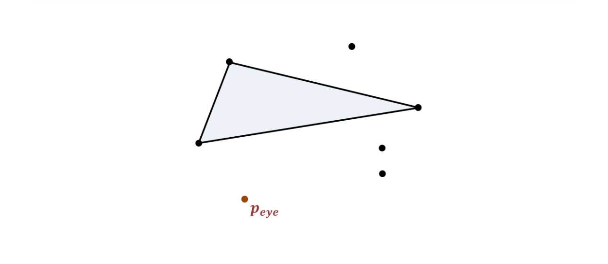

Source : D. Gregorius (Valve), Implementing QuickHull, GDC 2014

--- 
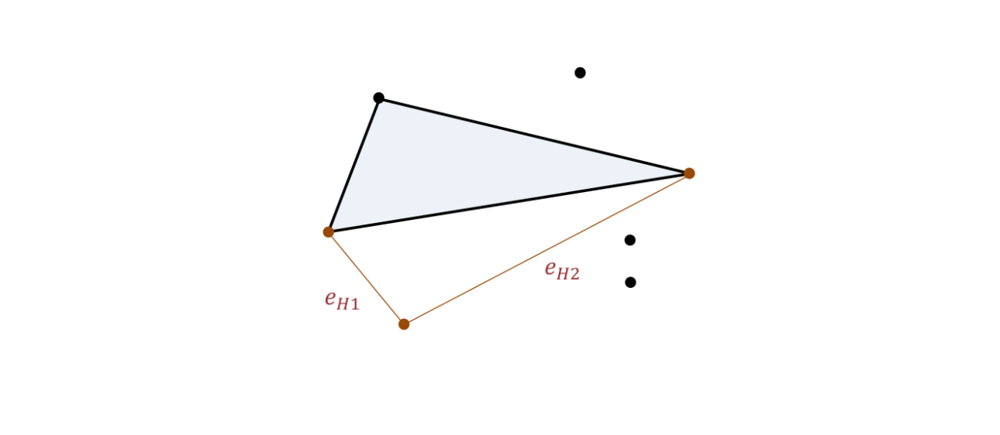

Source : D. Gregorius (Valve), Implementing QuickHull, GDC 2014

--- 
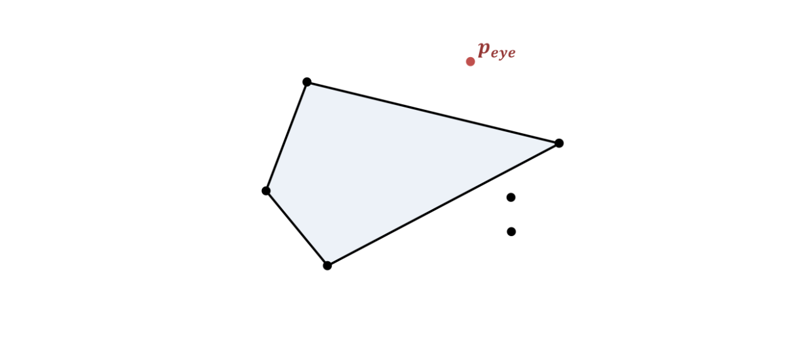

Source : D. Gregorius (Valve), Implementing QuickHull, GDC 2014

--- 
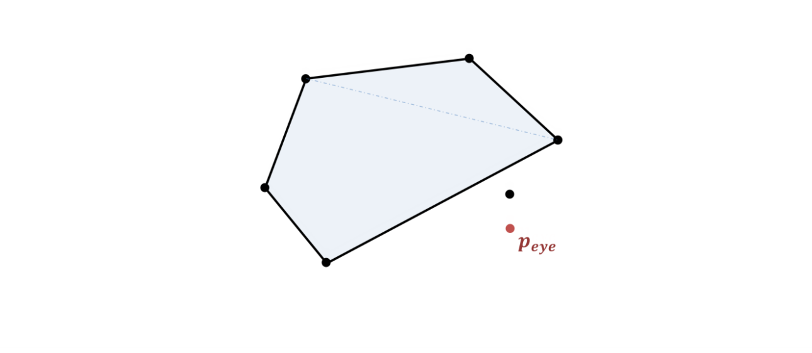

Source : D. Gregorius (Valve), Implementing QuickHull, GDC 2014

--- 
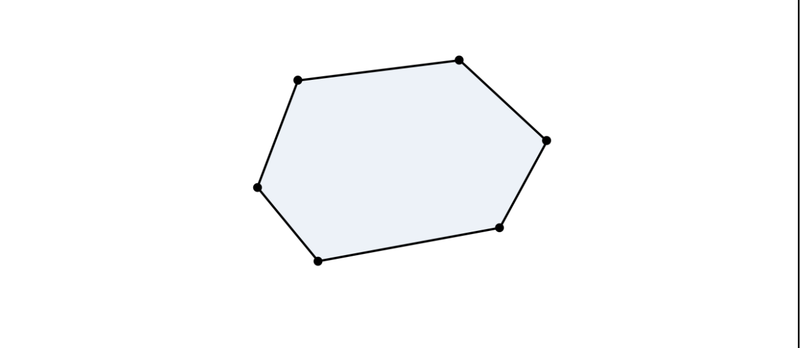

Source : D. Gregorius (Valve), Implementing QuickHull, GDC 2014

---
# QuickHull: Opérations à virgule flottantes 

* Les calculs à virgule flottantes sont sujets à des instabilités dues à leur représentation finie. (IEEE 754)
 
$$

0.1 + 0.2 = 0.30000000000000004
$$

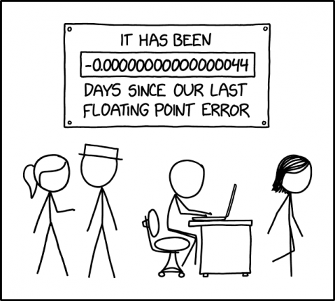

*Source: https://www.explainxkcd.com/wiki/index.php/3228:_Day_Counter*

---
# QuickHull: Opérations à virgule flottantes 

## Epsilon ($\epsilon$)

* On ajoute une valeur de sécurité ignorant les points qui sont trop proches d'une face.
* Permet d'éviter les divisions par 0.

## Jittering

* Ajoute une très petite valeur aux coordonnées des points pour éviter que les points soient trop proches.

---
# Complexité

- L'algorithme de QuickHull a une complexité **moyenne** de $\mathcal{O}(n \log v)$.

- Dans le pire des cas $\mathcal{O}(n^{\lfloor{d/2}\rfloor})$ $\rightarrow$ quand $d$ augmente, le temps d'exécution augmente fortement :turtle:

- QuickHull implémenté dans la bibliothèque qhull $\rightarrow$ bibliothèque de référence.

---
<!-- _class: sep -->

# État de l'art

---

# État de l'art: Tzeng & Owens

* Implémentation de QuickHull en 2D.
* Se base principalement sur le scan segmenté.
* **Speedup**:  ~x23 par rapport à *qhull*.
---

# État de l'art: Tang et al.

* Implémentation de QuickHull en 3D (extensible en n-D).
* Création d'une enveloppe pas spécialement convexe de manière greedy
* Filtrage des données sur GPU
* Lance *qhull* pour le reste des points.
* **Speedup**: ~40x par rapport à *qhull* 

---
# État de l'art: ghull

* Implémentation de QuickHull en 3D.
- Approxime l'enveloppe convexe via un diagramme de Voronoi
- Ajoute les points en dehors de l'enveloppe un à un.
- **Speedup**: ~6x par rapport à *qhull*.

---

# État de l'art: CudaHull
* Implémentation de QuickHull en 3D.
* Filtre d'abord les données
* Implémentation de QuickHull sur GPU.
* **Speedup**: ~39x par rapport à *qhull*.

---

# État de l'art: Récapitulatif

| Algorithme      | Dimensions | Backend  | Open-source |
|----------------|------------|-----------|-------------|
| Tzeng & Owens  | 2D         | CUDA      | Non         |
| Tang et al.    | 3D+        | CUDA      | Non         |
| ghull          | 3D         | CUDA      | Oui         |
| CudaHull       | 3D         | CUDA      | Non         |

**Problème** $\rightarrow$ uniquement CUDA et 2D/3D :cry: 

---
<!-- _class: sep -->

# Contribution
---

# Contribution
**GPUConvexHull.jl**: Implémentation de n-D QuickHull sur GPU en Julia. 
-

$\rightarrow$ Se base sur l'aspect segmenté des données.
$\rightarrow$ Se base fortement sur des primitives GPU.
$\rightarrow$ Implémenté avec la bibliothèque *KernelAbstractions.jl* 

---

# Primitives GPU
- **Réduction Min-Max**: calcule le min et le max d'une liste.
- **Scan segmenté**: effectue un préfix sum sur des segments d'une liste.
- **Compact**: Enlève les données d'une liste. 

---

# Création du simplexe

*  Prendre le min et le max dans chaque dimension (GPU)
* **Failsafe:** S'il n'y a pas $d+1$ points alors on fait comme QuickHull (CPU).

$\rightarrow$ On retire les points à l'intérieur avec un compact (GPU)

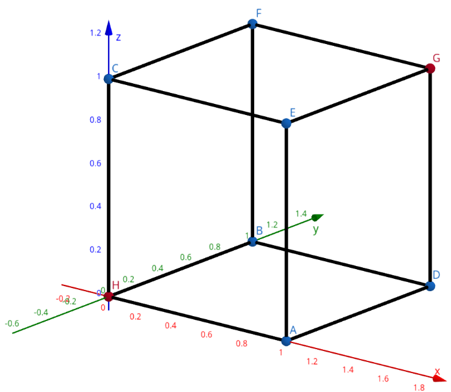

---

# Assigner les points aux faces

* Pour chaque point on va calculer quelle face est la plus proche et lui assigner cette face (GPU)

* Permet de faire des opérations par faces.

$\rightarrow$ Nous permet de trouver le point le plus loin pour chaque face.

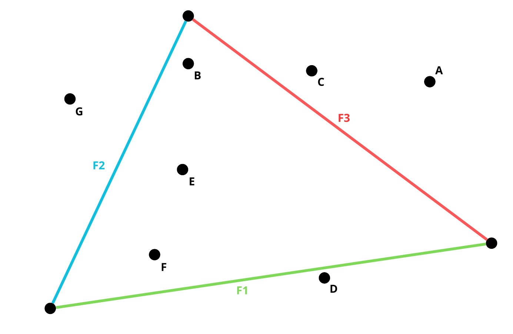

---

# Mettre à jour notre enveloppe convexe

* Ajouter un point $\rightarrow$ change la topologie $\rightarrow$ recalculer les hyperplans.

- Difficile de paralléliser sur GPU de manière efficace $\rightarrow$ implémentation sur CPU pour l'instant. 

 

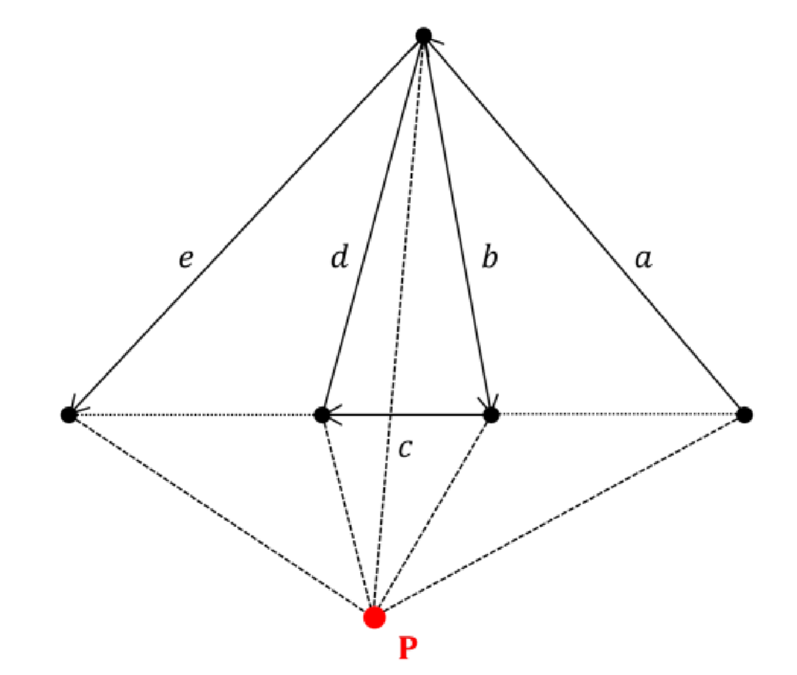

*Source: D. Gregorius (Valve), Implementing QuickHull, GDC 2014*

---

# Architecture du programme

*Figure 3: Architecture du programme. Les cases vertes tournent sur le GPU, les rouges sur le CPU*

---

<!-- _class: sep 
_paginate: false-->

# Résultats

---
# Résultats: Temps d'exécution hypercube
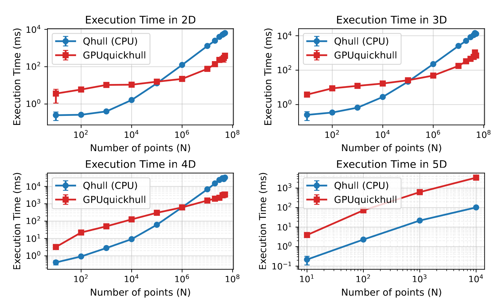

---
# Résultats: Temps d'exécution hypersphère

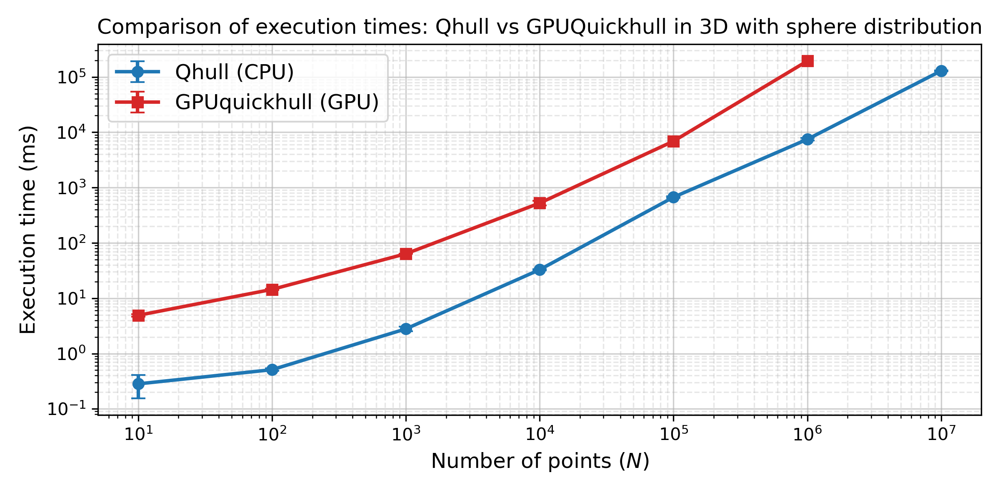

---

# Résultats: La mémoire ? (1) 
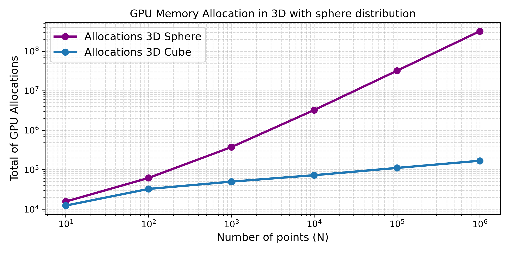

---

# Résultats: La mémoire ? (2)

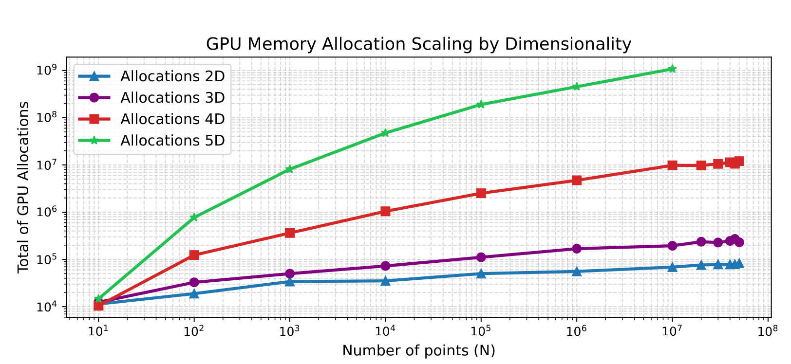

---

# Résultats: Qu'est-ce qui prend du temps ? (1) 

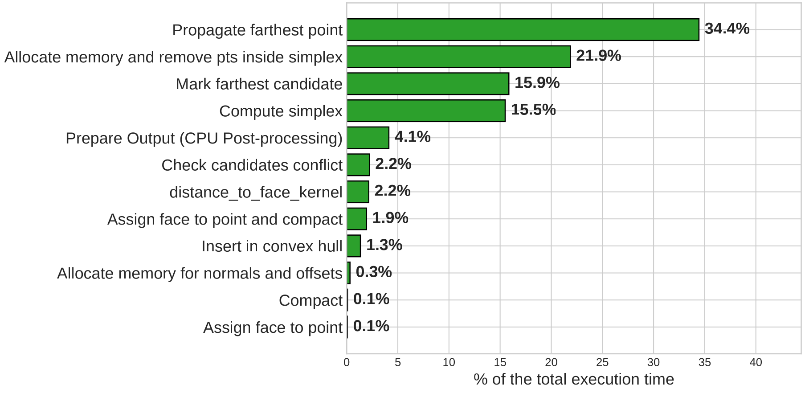

*Figure 4: Distribution unsiforme dans un cube en 3D (N = $10^6$ ).* 

---
# Résultats: Qu'est-ce qui prend du temps ? (2)

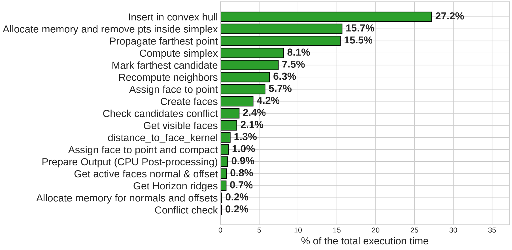

*Figure 5: Distribution uniforme sur une sphere en 3D (N = $10^6$ ).* 

---
# Résultats: Bottleneck

- Le scan segmenté.
- Les allocations de mémoire
- L'insertion des points dans l'enveloppe convexe.
$\rightarrow$ avec $10^5$ points (0.8 MB) sur une sphère, **uniquement** l'insertion de point alloue ~18,392MB

---

# Validation

**Problème :** Qhull fusionne les faces coplanaires (face merging), 
Pas nous $\rightarrow$ on ne peut pas comparer les sommets directement.

**Notre approche :** vérifier que nos sommets se trouvent 
sur les hyperplans générés par Qhull.

| Dimension | N | Distribution | Écart max |
|:---|---|---|---|
| 2D | $100$ | Uniforme | $1.39 × 10^ {-17}$ |
| 3D | $1000$ | Uniforme | $2.22 × 10^ {-16}$ |
| 3D | $1000$ | Sphère | $2.22 × 10^ {-16}$ |
| 4D | $500$ | Uniforme | $4.44 × 10^ {-16}$ |

---

# Pistes d'amélioration

- **Face merging**: éviter les instabilités sur inputs dégénérés

- **Topologie entièrement sur GPU**:  bottleneck en haute dimension
  *(en cours de développement)*.

- **Réduire les allocations dynamiques**: principale cause 
  du ralentissement en haute dimension.

- **Epsilon adaptatif** : actuellement fixé à $10^{-9}$ arbitrairement,
  Qhull l'adapte aux données.

- **Scan plus efficace**: algorithmes comme Merrill & Garland 
  potentiellement 2x plus rapides.
---

# Conclusion

* **GPUConvexHull.jl**: première bibliothèque open-source, 
hardware-agnostique et n-dimensionnelle pour QuickHull sur GPU.

* Speedup jusqu'à **~20×** par rapport à *qhull* en 2D/3D.

* Bonne base pour la suite. 

---
<!-- _class: sep 
_paginate: false-->

# Questions ?

---

# Références

[1] Mingcen Gao et al. “gHull: A GPU algorithm for 3D convex hull”. In: ACM
Transactions on Mathematical Software (TOMS) 40.1 (2013), pp. 1–19.

